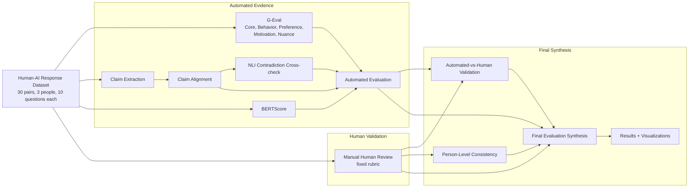
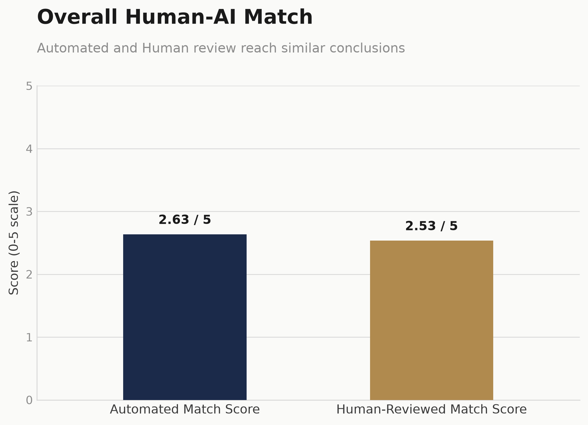
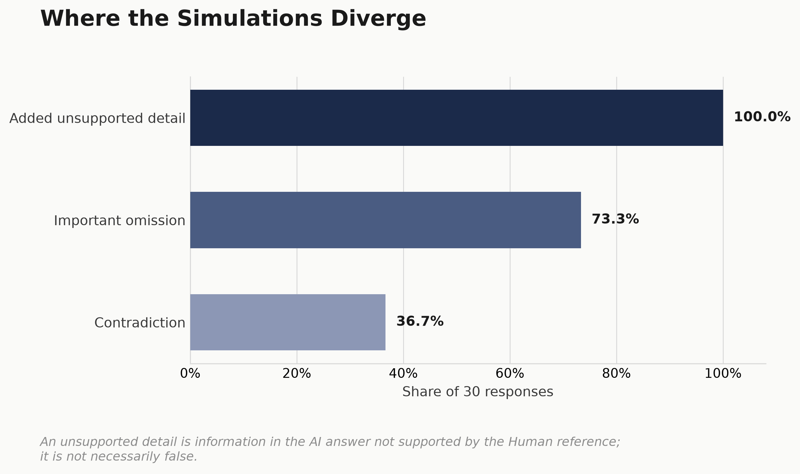
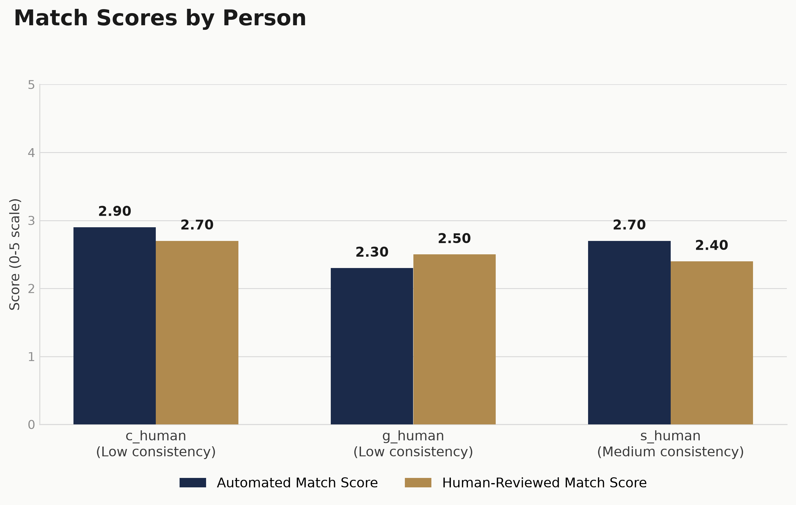

# Human–AI Behavioral Fidelity Evaluation

Evaluates how faithfully LLM-based human simulations reproduce the behavior, preferences, motivations, and nuance of the real people they were built to mimic.

## Overview

The dataset contains 30 paired Human and AI-simulated responses: 3 individuals (`c_human`, `g_human`, `s_human`), 10 open-ended market-research questions each. Each AI answer was generated by that person's human simulation; the paired Human answer comes from a second, held-out interview used only for evaluation.

This is not generic answer-quality scoring. The question for every pair is whether the simulation preserves that specific individual's actual behavior, preferences, motivations, reasoning, and nuance — or whether it produces a plausible-sounding answer that drifts from what that person actually said.

## Start Here

`outputs/` contains many intermediate and diagnostic files retained for reproducibility. For a first read, these are the reviewer-facing outputs:

| File | Purpose |
| --- | --- |
| [`outputs/final_evaluation_summary.md`](outputs/final_evaluation_summary.md) | Main final findings, in prose |
| [`outputs/final_evaluation.xlsx`](outputs/final_evaluation.xlsx) | Detailed reviewer-friendly workbook (row-level, person-level, overall) |
| [`outputs/final_pairwise_evaluation.csv`](outputs/final_pairwise_evaluation.csv) | Row-level final evaluation, one row per response pair |
| [`outputs/figures/`](outputs/figures/) | Presentation-ready visualizations |

Everything else under `outputs/` (G-Eval, claim-level, NLI, BERTScore, and human-review files) is supporting evaluation evidence for the automated and human-validation methods described below.

## Evaluation Strategy

Behavioral fidelity cannot be measured reliably with a single metric, so the project combines several complementary methods rather than relying on one.

| Method | Purpose |
| --- | --- |
| G-Eval | Whole-answer behavioral fidelity assessment |
| Atomic claim extraction + alignment | Fine-grained preservation, omission, contradiction, and unsupported-detail analysis |
| NLI | Independent contradiction cross-check |
| BERTScore | Contextual semantic-similarity diagnostic |
| Automated evaluation | Consolidates automated evidence without blending it into a weighted score |
| Human validation | Manual review using a fixed rubric, used to validate the automated judgments |
| Person-level consistency | Assesses consistency across each individual's ten responses |

G-Eval Core Fidelity is the primary automated 1–5 score. Behavior, Preference, Motivation, and Nuance are four additional G-Eval dimensions, each independently judged and applicable/N/A per pair. Claim alignment, NLI, and BERTScore are diagnostic signals alongside G-Eval — they are not combined into an arbitrary weighted composite.

A few terminology notes that matter for reading the results:

- BERTScore measures semantic similarity, not behavioral correctness or factual accuracy.
- NLI is used mainly as an independent contradiction cross-check against claim alignment, not as the primary fidelity signal.
- "Unsupported" means unsupported by the Human reference answer — it does not by itself mean false or hallucinated; the Human reference may simply not have mentioned it.

## Evaluation Architecture



The dataset feeds G-Eval, claim extraction, BERTScore, and manual Human review independently. Claim extraction feeds claim alignment, which provides matched claim pairs for the NLI contradiction cross-check. G-Eval, claim-level metrics, NLI, and BERTScore are consolidated as automated evidence without averaging or weighting them into a composite score. The automated results are then compared with structured Human review to produce the automated-vs-human validation, while person-level consistency examines patterns across each individual's ten responses. Automated evaluation, automated-vs-human validation, Human review, and person-level consistency all feed the final synthesis and visualizations.

### Architecture explanation

| Component | What it contributes |
| --- | --- |
| G-Eval | Primary whole-answer automated assessment (Core Fidelity + 4 diagnostic dimensions) |
| Claim analysis | Fine-grained preservation, omission, contradiction, and unsupported-detail evidence |
| NLI | Independent contradiction cross-check on matched claim pairs |
| BERTScore | Semantic-similarity diagnostic |
| Automated Evaluation | Consolidates automated evidence without a weighted composite |
| Human Validation | Manual reference used to validate automated judgments |
| Person-Level Consistency | Checks whether each person's ten responses are represented consistently |
| Final Synthesis | Produces the final row-level and aggregate reviewer-facing outputs |

## Key Findings

Across all 30 rows:

| Metric | Value |
| --- | --- |
| Automated Match Score (mean) | 2.63 / 5 |
| Human-Reviewed Match Score (mean) | 2.53 / 5 |
| Automated / Human-Reviewed median | 3 / 3 |
| Exact automated–human agreement | 15 / 30 (50%) |
| Agreement within one point | 30 / 30 (100%) |
| Spearman rank correlation (Human vs. G-Eval Core) | ρ ≈ 0.82 |

Human-reviewed failure flags (share of the 30 rows):

| Flag | Rate |
| --- | --- |
| Contradiction | 36.7% |
| Important omission | 73.3% |
| Unsupported detail | 100% |

Claim-level evidence (from claim extraction + alignment, all 30 rows):

| Claim outcome | Count | Share |
| --- | --- | --- |
| Human claims, total | 121 | — |
| Aligned | 15 | 12.4% |
| Partial | 35 | 28.9% |
| Contradicted | 10 | 8.3% |
| Missing | 61 | 50.4% |
| AI claims, total | 254 | — |
| Unsupported AI claims | 198 | 78.0% |

The simulations often preserve parts of the broad theme of a Human response, but person-specific details, preferences, motivations, quantities, and nuance are frequently omitted or replaced with unsupported elaboration. Some responses also contain direct behavioral or preference reversals. Unsupported AI claims are unsupported relative to the Human reference; this does not establish that they are factually false or hallucinated.

## Representative Failure Patterns

A few recurring patterns, illustrated with short excerpts from the final pairwise evaluation:

**Direct behavioral reversal** — Human: *"i don't usually buy in bulk, but rather as soon as i need them."* AI: *"i regularly buy toothpaste and deodorant in bulk..."* The AI states the opposite buying behavior and adds unsupported specifics.

**Unsupported personal elaboration on a correct choice** — Human: *"i would chose option 2."* AI keeps Option 2 but adds several unsupported reasons about hydration and daily use that the Human never stated.

**Celebrity/preference mismatch** — Human is uncertain and, if forced, picks Keira Knightley; the AI instead confidently selects a different celebrity (Hyram Yarbro) with invented supporting reasons.

**Broad theme preserved, detail lost** — Human: *"usually my friends or what i see is famous in instagram."* The AI keeps friends/social media as discovery channels but adds many unsupported extra influences (reviews, ads, ingredients, price).

## Automated vs. Human Validation

Human validation was included because no single automated signal can be trusted to judge behavioral fidelity on its own — LLM judges and NLI/embedding models can miss context-dependent reversals or over/under-penalize stylistic differences. A fixed-rubric manual review of all 30 pairs (score, contradiction, omission, unsupported-detail flags, and a note) was compared against the automated signals.

The two agree closely in aggregate: Automated Match Score 2.63/5 vs. Human-Reviewed Match Score 2.53/5, exact agreement on 50% of rows, agreement within one point on 100% of rows, and a strong Spearman rank correlation (ρ ≈ 0.82, n = 30). With only 30 rows this correlation should be read directionally, not as a precise statistic, and strong rank agreement does not by itself prove the automated evaluator is correct on any individual row.

Contradiction detection specifically was cross-checked against the human contradiction flag: the claim-based check and the human label agree on 90% of rows (precision 1.00, recall 0.73), and the NLI check also agrees on 90% of rows (precision 0.90, recall 0.82). Human review remains important for meaningful behavioral reversals, deciding which omissions actually matter, resolving scope/context ambiguity, and borderline cases where the automated signals disagree with each other.

## Person-Level Results

| Person | Automated Match | Human-Reviewed Match | Consistency |
| --- | --- | --- | --- |
| c_human | 2.90 | 2.70 | Low |
| g_human | 2.30 | 2.50 | Low |
| s_human | 2.70 | 2.40 | Medium |

Consistency here reflects a manual cross-row review of whether each person's simulation stays coherent with itself across their ten different questions — it is a separate, higher-level check, not a ranking of which simulation is "better."

## Visual Results

All four figures are available under [`outputs/figures/`](outputs/figures/). Three of the strongest are shown here:





## Design Decisions

**Pairwise-first evaluation.** Every AI response is scored directly against its corresponding Human response, question by question, before any aggregation to person- or dataset-level. Person-level and dataset-level numbers are always derived from the 30 row-level judgments, never estimated independently.

**No weighted composite.** G-Eval, claim alignment, NLI, and BERTScore each measure a different property (holistic fidelity, claim-level preservation, entailment/contradiction, and semantic similarity, respectively). They are kept separately interpretable rather than blended into one arbitrary weighted score. G-Eval Core Fidelity remains the single primary automated score.

**Human validation.** Automated judgments are compared against structured manual review to understand where they agree, where they disagree, how well automated contradiction detection performs, and which omissions and borderline cases still need a human reader.

## Repository Structure

```
.
├── src/                          # Evaluation pipeline (extraction, alignment, scoring, synthesis)
├── tests/                        # Automated test suite
├── data/                         # Source dataset and the manually completed human review
├── docs/
│   └── evaluation_rubric.md      # Fixed 1-5 + N/A rubric used by G-Eval and human review
├── outputs/
│   ├── figures/                  # Final visualizations
│   ├── final_evaluation_summary.md
│   ├── final_evaluation.xlsx
│   ├── final_pairwise_evaluation.csv
│   └── ...                       # Supporting evaluation evidence (G-Eval, claims, NLI, BERTScore, human review)
├── requirements.txt
├── pyproject.toml
└── README.md
```

## Implementation Map

| Method | Source |
| --- | --- |
| G-Eval | `src/geval_evaluator.py`, `src/run_geval.py` |
| Atomic claim extraction | `src/claim_extractor.py`, `src/run_claim_extraction.py` |
| Claim alignment | `src/claim_aligner.py`, `src/run_claim_alignment.py` |
| NLI cross-check | `src/nli_validator.py`, `src/run_nli_validation.py` |
| BERTScore | `src/bertscore_evaluator.py`, `src/run_bertscore.py` |
| Automated evaluation | `src/automated_evaluation.py`, `src/run_automated_evaluation.py` |
| Human validation | `src/human_review.py`, `src/run_human_review.py` |
| Person-level consistency | `src/person_consistency_review.py`, `src/run_person_consistency_review.py` |
| Final synthesis | `src/final_evaluation.py`, `src/run_final_evaluation.py` |
| Visualizations | `src/visualize_results.py`, `src/run_visualizations.py` |

Structured schemas for every stage's inputs/outputs live in `src/schemas.py`; shared paths and environment loading live in `src/config.py`.

## Setup

Requires Python 3.11+ (see `.python-version` / `pyproject.toml`).

```bash
git clone https://github.com/Pavankumarmanagoli/RB_GEN_AI_ASSESEMENT.git
cd RB_GEN_AI_ASSESEMENT

python -m venv .venv
source .venv/bin/activate      # Windows: .venv\Scripts\activate

pip install -r requirements.txt
```

The repository also includes a `uv.lock`; if you use [uv](https://docs.astral.sh/uv/), `uv sync` is an equivalent alternative to the steps above.

## Configuration

G-Eval, claim extraction, and claim alignment call the OpenAI API and require credentials in a local `.env` file (never commit this file; `.env.example` contains empty placeholders):

```dotenv
OPENAI_API_KEY=<your API key>
EVALUATOR_MODEL=<a model available to your account with structured-output support>
```

Both variables are required before any of those three stages will run (`src/config.py`). No model is silently substituted.

The NLI cross-check and BERTScore stages run local Hugging Face models instead — `roberta-large-mnli` and `roberta-large` respectively — downloaded on first use and requiring no API key; they run on CUDA or Apple MPS if available, falling back to CPU. The remaining stages (human validation join, person-level consistency, automated evaluation, final synthesis, visualizations) only read and write local files.

## Running the Evaluation

The stages below reproduce the frozen final outputs, in dependency order. G-Eval, claim extraction, and claim alignment checkpoint each `--full` run to a version-tagged file (e.g. `geval_results_fidelity-v4_full.json`); the canonical `*_final.*` files already present in `outputs/` are that checkpoint finalized under its stable name for downstream stages to consume.

**1. Automated signal generation**

```bash
python -m src.run_geval --full
python -m src.run_claim_extraction --full
python -m src.run_claim_alignment --full
python -m src.run_nli_validation --full
python -m src.run_bertscore
```

`run_nli_validation --full` reads `claim_extraction_final.json` and `claim_alignment_final.json`, so those two must already exist under their final names before it runs. G-Eval, claim extraction, and claim alignment also each accept `--rows ID [ID ...]` to target specific rows instead of a full run.

**2. Automated synthesis**

```bash
python -m src.run_automated_evaluation
```

Reads `geval_results_final.json`, `claim_alignment_final.json`, `nli_validation_final.json`, and `bertscore_final.json`; writes `automated_evaluation_by_row.*` and `automated_evaluation_summary.*`.

**3. Human validation (manual-review-dependent)**

```bash
python -m src.run_human_review
```

Requires `data/human_fidelity_review.xlsx` — a manually completed reviewer spreadsheet (30 rows: fidelity score, contradiction/omission/unsupported-detail flags, and a note) — to already exist; this file is included in the repository. The runner blind-matches review rows back to the dataset by content rather than trusting row order, and joins the result against the four automated signal files above. Writes `human_review_final.*`.

**4. Person-level consistency (manual-review-dependent)**

```bash
python -m src.run_person_consistency_review
```

Reads `human_review_final.json` and writes `person_consistency_review.xlsx` with blank per-person fields (`consistent_traits`, `inconsistent_traits`, `invented_profile_traits`, `overall_consistency`, `person_level_note`). **A reviewer must open this workbook and fill in those fields by hand before the next stage.** The already-completed version is included in `outputs/`.

**5. Final synthesis and visualizations**

```bash
python -m src.run_final_evaluation
python -m src.run_visualizations
```

Final evaluation reads the automated summary, `human_review_final.json`, and the manually completed `person_consistency_review.xlsx`, and writes `final_pairwise_evaluation.*`, `final_evaluation_summary.*`, and `final_evaluation.xlsx`. Visualizations reads `final_evaluation_summary.json` and `final_pairwise_evaluation.json` and writes the four PNGs under `outputs/figures/`.

This pipeline is not a single one-command run: stages 3 and 4 depend on manually produced or manually completed spreadsheets, by design, because behavioral fidelity includes context-dependent judgments that the automated signals do not fully resolve.

## Running Tests

```bash
python -m unittest discover -s tests -v
```

The current repository test suite contains 196 passing tests.

## Output Guide

| Group | Files |
| --- | --- |
| Whole-answer evaluation | `geval_results_final.json`, `geval_results_final.csv` |
| Claim analysis | `claim_extraction_final.json`, `claim_extraction_final.csv`; `claim_alignment_final.json`, `claim_alignment_final.csv` |
| Contradiction validation | `nli_validation_final.json`, `nli_validation_final.csv` |
| Semantic similarity | `bertscore_final.json`, `bertscore_final.csv` |
| Human validation | `human_review_final.json`, `human_review_final.csv`; `person_consistency_review.xlsx` |
| Automated synthesis | `automated_evaluation_by_row.json`, `automated_evaluation_by_row.csv`; `automated_evaluation_summary.json`, `automated_evaluation_summary.md` |
| Final synthesis | `final_pairwise_evaluation.json`, `final_pairwise_evaluation.csv`; `final_evaluation_summary.json`, `final_evaluation_summary.md`; `final_evaluation.xlsx` |
| Visualizations | `outputs/figures/` |

Formats: JSON is the machine-readable/reproducibility format; CSV supports tabular analysis; XLSX is for reviewer-friendly detailed inspection; Markdown gives a concise readable summary; PNG figures are presentation-ready.

## Limitations

- Only 30 Human–AI response pairs across 3 individuals; findings should not be generalized beyond this dataset.
- LLM-as-judge results (G-Eval) can be sensitive to the underlying model and prompt.
- NLI contradiction detection can be sensitive to scope and context that a short claim pair doesn't fully capture.
- BERTScore measures semantic similarity, not behavioral correctness; its baseline-rescaled values have no universal percentage interpretation.
- "Unsupported by the Human reference" does not necessarily mean factually false.
- Manual review still involves subjective judgment, even against a fixed rubric.

## Potential Improvements

- A larger human-validation sample, and multiple human reviewers with inter-rater agreement, would strengthen confidence in the validation numbers.
- Further evaluator calibration on additional examples could tighten edge cases (e.g. hypothetical/forced-choice framing).
- Stronger grounding of simulations to person-specific evidence could reduce unsupported elaboration.
- Explicit uncertainty handling when person-specific evidence is absent, rather than confident invention.
- Automated escalation of high-confidence contradictions or omissions for priority human review.
- Longitudinal evaluation across more questions and scenarios per person.

## Reproducibility

- All LLM outputs are validated against Pydantic schemas (`src/schemas.py`) before being saved.
- G-Eval, claim extraction, and claim alignment use versioned prompts (`fidelity-v4`, `claims-v2`, `alignment-v2`) recorded alongside each result.
- API/model calls are cached by input, model/options, prompt, and schema, so re-running with an unchanged configuration reuses prior results instead of re-querying.
- Each stage has an explicit runner script and a corresponding automated test module.
- All intermediate and final results are exported as JSON/CSV (and XLSX/Markdown for reviewer-facing outputs), so every downstream number can be traced back to its source file.
